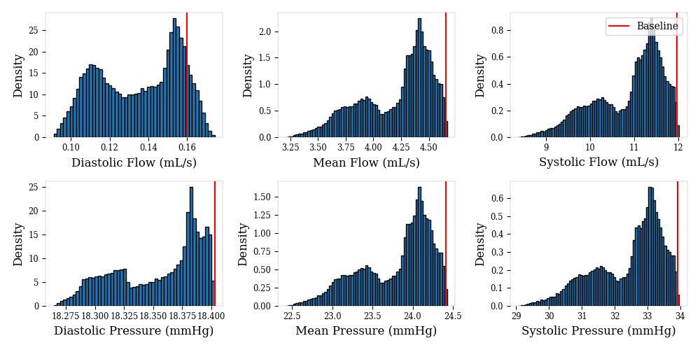
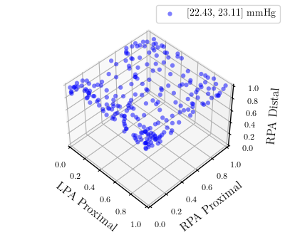

# A Probabilistic Neural Twin for Treatment Planning in Peripheral Pulmonary Artery Stenosis

## Description

The substantial computational cost of high-fidelity models in numerical hemodynamics has, so far, relegated their use mainly to offline treatment planning. New breakthroughs in data-driven architectures
and optimization techniques for fast surrogate modeling provide an exciting opportunity to overcome
these limitations, enabling the use of such technology for time-critical decisions. We discuss an application to the repair of multiple stenosis in peripheral pulmonary artery disease through either transcatheter
pulmonary artery rehabilitation or surgery, where it is of interest to achieve desired pressures and flows
at specific locations in the pulmonary artery tree, while minimizing the risk for the patient. Since different degrees of success can be achieved in practice during treatment, we formulate the problem in
probability, and solve it through a sample-based approach. We propose a new offline-online pipeline
for probabilistic real-time treatment planning which combines offline assimilation of boundary conditions, model reduction, and training dataset generation with online estimation of marginal probabilities,
possibly conditioned on the degree of augmentation observed in already repaired lesions. Moreover, we
propose a new approach for the parametrization of arbitrarily shaped vascular repairs through iterative
corrections of a zero-dimensional approximant. 

This Git Directory contains the source code and scripts for replicating our pipeline.

## [Published Paper](https://onlinelibrary.wiley.com/doi/10.1002/cnm.3820)

## [Arxiv Paper](https://arxiv.org/abs/2312.00854)

## Graphical Abstract


## Sample Data
The sample dataset used in the paper can be downloaded [here](https://drive.google.com/drive/folders/0Bz09B6hXwS2kfmdkN3paOWNwTUg5dVUwbTdxWkdfb1FaNVJaZGMwV2dDWnJtODF4QkJ6MTg?resourcekey=0-sZjI-CJPwlUpfOHLjZML7g&usp=sharing). It corresponds to model AS1_SU0308_poststent in the [Vascular Model Repository](https://www.vascularmodel.com/).

## Installation

The installation is currently only supported for MacOS/Ubuntu.

#### Simvascular

Several pre-processing stages of this pipeline was written to connect with Simvascular. The primary requirement is access to `simvascular --python`.

1. Go to [Simvascular](https://github.com/SimVascular/SimVascular) and install either the most recent Github Build, or the official release.
2. Navigate to the Simvascular Home Folder on your local machine and run the shell script `./Simvascular`. You may need to modify the contents depending on your path.

Your Simvascular cmd line should now be set up.

#### Stenosis Tool

1. Clone this repository using `git clone https://github.com/JohnDLee/StenosisTool.git` (Subject to change).
2. If you have conda/miniconda installed, you can create a virtual environment using `conda env create -f environment.yml`. Otherwise, install the packages listed in `environment.yml`
3. You may need to install cuda versions of [Pytorch](https://pytorch.org/get-started/locally/) to run models on Nvidia GPU's. This pipeline was run using `torch==1.13.1+cu117`
4. Run `pip3 install [-e] .` to install the svinterface library. `[-e]` is for editable mode.

#### svZeroDSolver C++

The svZeroDSolver is how 0D simulations are run. There are two options for installation. 

***Note: Due to the constant updating nature of the svZeroDPlus Solver, only the pip installation `pysvzerod==2.0` is verified***

##### Option 1 (pip)
In most cases a pip install is sufficient.

1. `pip install git+https://github.com/simvascular/svZeroDSolver.git`
2. If the building process fails due to missing libraries, they may need to be installed.

##### Option 2 (building using CMake)
The github repository can also by cloned into the main repository and built using CMake.

1. In the Stenosis Tool repository, run `git clone https://github.com/simvascular/svZeroDSolver` (Subject to change).
2. Navigate to the svZeroDPlus directory.
3. Follow instructions under [C++ Documentation](https://simvascular.github.io/svZeroDSolver/) to install dependencies and build the C++ Solver

The setup should now be complete.


## Running Pipeline (Overview)

Each tool has been seperated into individual scripts. A more detailed description of what each file does can be found [here](docs/script_documentation.txt). In general, steps are presented assuming a smooth workflow.


### Prerequisites (00)

There are several prerequisites to be satisfied prior to beginning the pipeline.

1. *A prestent VTP (`.vtp`) and corresponding MDL (`.mdl`) file containing the model prior to any stenting procedure. Typically, these can be found in the `Models` directory of a Simvascular project.
2. *N poststent VTP and MDL files containing the model after stenting a SINGLE repair location.
3. An exported CapInfo file from Simvascular, containing the cap name and area for each face in the pre-stent model.
4. A inflow waveform file in the _POSITIVE_ direction, as opposed to the _negative_ direction used in svSolver.
5. (Optionally) RCRT boundary conditions in a (`.rcrt`) file. This file must be in the format accepted by the 0D solver.

*Additionally, the name of the inlet cap for each model must be known (they may be different across models depending on naming convention)


### Setup workspace (01)

We set up an isolated workspace to avoid overwriting information in the original directory.

#### Generating a config file

A config file can be generated using the below command (It is highly recommended to be placed in the same general directory as the data files)

```
python3 scripts/01_dev/generate_sv_config.py -o <outdir>
```

The config file looks as follows, with comments on each line corresponding to a prerequisite listed in the prior section:

***ALL PATHS MUST BE RELATIVE TO THE LOCATION OF THE CONFIG FILE***

```
# SV Workspace
workspace:
  surface_model: "Models/AS1_SU0308_prestent.vtp"   # pre-stent vtp file (1)
  mdl: "Models/AS1_SU0308_prestent.mdl"             # pre-stent mdl file (1)
  flow_file: "flow_files/inflow_1D.flow"            # inflow waveform file (4)
  rcrt_file:                                        # Optional rcrt file (5) -> if provided, tune parameter should be false
  capinfo: "Models/AS1_SU0308_prestent_CapInfo"     # CapInfo file (3)

# Metadata about model
metadata: 
  model_name: "AS1_SU0308"                          # A name for the model
  diseased: true                                    # diseased flag (typically should be true)
  inlet: "cap_RPA"                                  # the name of the inlet cap to the model

# Options in pipeline
options:
  tune: true                                        # whether the model requires boundary condition tuning -> should be true if rcrt_file is empty

# Tuning Parameters
...                                                 # These can be filled later (and are only necessary if tuning is required).
```

#### Generating workspace

We can generate a workspace anywhere using the command:

```
python3 scripts/01_dev/setup_workspace.py -i <path_to_config> \
                                          -o <path_to_directory>
```

Files are copied from their original location and renamed. A new config file is generated, referred to as the main config file from now on.

### Centerline Generation (02)

For each model, pre-stent and post-stent, centerlines must be generated. Depending on the quality of the models, this step may throw an error (centerlines failed to be generated), which can only be resolved by refining the models manually in Simvascular.

Generating the pre-stent centerlines is easily accomplished by running the script below and the centerlines will be tracked automatically.

```
python3 scripts/02_centerline_gen/centerline_gen_diseased.py -i <path_to_config>
```

Generating the post-stent centerlines for each model must be done manually. It is recommended to construct a directory along the lines of "poststent_centerlines" to save the centerlines. Use

```
python3 scripts/02_centerline_gen/centerline_gen_diseased.py  -mdl <path_to_poststent_mdl> \
                                                              -vtp <path_to_poststent_vtp> \
                                                              -inlet <name_of_inlet_cap>   \
                                                              -o <file_output_path>
```

*<file_output_path> is the path to save the output centerlines to and should be of the form `(name).vtp`.

### Lumped Parameter Network (LPN) Setup (03)

#### Generating LPN
With the centerlines, we can use Simvascular's inbuilt functionality to generate a default setup for an LPN/0D model with:

```
python3 scripts/03_lpn_setup/lpn_segmentation.py -i <config_file>
```

This should generate a directory called `LPN_DIR` within the directory containing relevant files. If a `.rcrt` file was provided in the original config, then it is copied into the directory. Otherwise, an empty rcrt with 0'd values is created.

*Note: a workaround was implemented here due to the challenges of connecting Simvascular's Python 3.5 and the newer version of Python, where the actual computation is done in `scripts/03_lpn_setup/sv_lpn_segmentation.py`.

#### Mapping LPN to centerlines
For a future step, it is important to map locations on the LPN and centerlines to each other. Running the script

```
python3 scripts/03_lpn_setup/map_junctions_to_centerlines.py -i <config_file>
```

will map global ids on the centerlines onto the lpn and vice versa.


### Boundary Condition Tuning (if necessary) (04)

The tuning procedure developed here was developed for the limited physiological information provided in our sample dataset and may not be an adequate procedure. Various automated pipelines exist and can replace the one provided here.

The necessary data, which must be filled in the config file, are as follows:

```
tune_params:
  PCWP: 18                  # Pulmonary Capillary Wedge Pressure -> Empirically, this value must be <= to the minPAP value otherwise capacitances may tune to 0.
  R_LPA: 2.81564864366      # *Nonlinear Resistance coefficient for LPA
  R_RPA: 5.5670662746       # *Nonlinear Resistance coefficient for RPA
  mPAP:
  - 42                      # lower bound mean Pulmonary arterial Pressure 
  - 42                      # upper bound mean Pulmonary arterial Pressure 
  maxPAP:
  - 90                      # lower bound systolic/max Pulmonary arterial Pressure 
  - 90                      # upper bound systolic/max Pulmonary arterial Pressure 
  minPAP:
  - 18                      # lower bound diastolic/min Pulmonary arterial Pressure 
  - 18                      # upper bound diastolic/min Pulmonary arterial Pressure 
  rpa_split: 0.52           # The flow split going into the RPA branch
```

*The Nonlinear resistance coefficients can be calculated through the procedure mentioned in Section 3 of the linked paper.

After the data is provided all that needs to be run is:

```
python3 scripts/04_tune/tune_bc_nonlinear.py -i <path_to_config>
```

### Running 0D Simulations and Visualization

After generating an LPN and determining boundary conditions, solving that LPN is easily accomplished by running:

```
python3 scripts/solver_scripts/run_lpn.py -i <config_file> \
                                          -n <name_for_sim> \
                                          [-c] [-b] [--l] [--m] [-v]
```

```
-n <name_for_sim> # a label for the simulation
-c                # whether to save results as a csv file (recommended)
-b                # whether to convert the c output to the old python output
--l               # flag to only output last cycle 
--m               # flag to only output mean values
-v                # whether to output a plot of the last 3 cycles to ensure convergence and verify other features
```

To run the original unoptimized LPN, the default line below should suffice:

```
python3 scripts/solver_scripts/run_lpn.py  -i <config_file> \
                                           -n "no_correction" \
                                           -c --l -v
```


### Computing 3D Prestent Ground Truth (05)

To perform optimization of LPNs, we need a ground truth 3D solution to optimize to. Setting up a 3D hemodynamic simulation is built into Simvascular, with instructions found [here](https://simvascular.github.io/documentation/flowsolver.html). The provided scripts convert boundary conditions and compress 3D solutions onto a 1D centerline.

#### Converting 0D RCR to 3D RCR Format
Tuned RCR boundary conditions can be converted to a valid 3D RCR boundary condition file by using the script

```
python3 scripts/05_3D_prestent/0D_rcrt_to_3D.py -rcrt <0D_rcrt_file_path> \
                                                -o <3D_simulation_dir_path>
```

where `<0D_rcrt_file_path>` is the path to the rcrt file after tuning (or provided), `<3D_simulation_dir_path>` is the directory containing all the files for a 3D simulation (which MUST include a `.svpre` and `.inp` file).

#### Mapping 3D solution onto 1D Centerlines

`scripts/05_3D_prestent/map_3D_centerlines.py` is a standalone script that can be copied and run on a compute cluster with minimal packages. After uploading the centerlines (which have been mapped to the LPN via `scripts/03_lpn_setup/map_junctions_to_centerlines.py`) to the compute cluster, 3D solutions can be mapped onto those centerlines as such.

```
python3 scripts/05_3D_prestent/map_3D_centerlines.py  -c <centerlines_vtp_file> \
                                                      -v <3D_solution_volume_vtu_file> \
                                                      -o <output_centerline_vtp_file> \
                                                      [--caps|--juncs|--0D]
```

where `<--caps|--juncs|--0D>` are optional mutually exclusive flags to map either all points onto the centerline (>2 hrs) or only the relevant 0D LPN locations (<1 minute).

***Note: The mapping script has a bug where the flows are computed incorrectly. However, the flows are not used in the current iteration of the pipeline***

#### Formatting 1D Mapped Solutions 

After mapping solutions onto the 1D centerlines, they should be downloaded and saved to a directory in the workspace. However, the mapping must be formatted one more time via

```
python3 scripts/05_3D_prestent/format_3D_centerlines.py -i <config_file> \
                                                        -c <3D_centerline_solution_vtp> \
                                                        -f <3D_inflow> \
                                                        --s
```

where `<3D_inflow>` is the file containing the _negative_ inflow waveform directly used by svSolver to solve the 3D solution.

### Linear Correction of Pre-stent LPN (06)

In our paper, we perform a linear correction based on mean pressures to optimize LPNs to the 3D solution. We described 4 progressively more accurate methods of correction - One-Step, Subdomains, Vessels, and Iterative.

#### One-Step Correction

This correction optimizes the resistances in the junctions of the LPN in one step, via a least squares method.

```
python3 scripts/06_linear_correction/linear_transform_unified.py -i <config_file>
python3 scripts/solver_scripts/run_lpn.py -i <config_file> \
                                          -n "one_step_correction" \
                                          -c --l -v
```

#### Subdomain Correction

This correction optimizes the resistances of the junctions in the LPN by cycling through the MPA, RPA, then LPA. The iterative method is included via the `-iter N` parameter. We determined that N=5 is sufficient for convergence.

```
python3 scripts/06_linear_correction/linear_transform_split.py  -i <config_file> \
                                                                -iter N
python3 scripts/solver_scripts/run_lpn.py -i <config_file> \
                                          -n "subdomain_correction" \
                                          -c --l -v
```


#### Subdomains + Vessel Correction

This correction does the same as the subdomains correction but includes vessels and junctions.

```
python3 scripts/06_linear_correction/linear_transform_all_split.py  -i <config_file> \
                                                                -iter N
python3 scripts/solver_scripts/run_lpn.py -i <config_file> \
                                          -n "all_subdomain_correction" \
                                          -c --l -v
```

#### Resetting a Correction

After performing a correction, various components of the LPN `.inp` file have been modified. If the correction is unsatisfactory, the lpn can be reset to the default by running:
```
python3 scripts/06_linear_correction/clear_linear_correction.py -i <config_file>
```

### Visualization of Prestent 0D solution projected on 1D centerlines

To compare with the 3D solutions (which are projected on 1D centerlines), we must first project the 0D solution onto the centerlines.

```
python3 scripts/viz_script/map_0D_to_centerlines.py -i <config_file> \
                                                    -sim <sim_number> \
                                                    [--mmHg] [--s]
```

where
```
-sim <sim_number>      # simulation number (not by simulation name)
--mmHg                 # flag to convert pressures to mmHg
--s                    # flag to only report summary values (sys, dia, mean) values across the centerlines
```

### Comparing prestent 3D solution to 0D solution

With both 3D and 0D solutions projected onto 1D centerlines, we can perform a comparison of the two.

```
python3 scripts/viz_script/plot_3D_vs_0D.py -i <config_file> \
                                            -sim <sim_number> \ 
                                            [-points]
```
where `-points` is an optional flag to also plot the entire waveform of each individual point on the centerline.

### Computing 3D Poststent Ground Truth (05)

To parameterize 0D LPNs, we also require 3D solutions of the post-stent scenario for each repair location. Thus, for N repair locations, we also require N 3D post-stent solutions. The procedure is largely similar to the pre-stent case but has some extra steps.

#### Matching post-stent and pre-stent centerlines
First, stented centerlines for each model should have been computed in Step 02. For each relevant point on the prestent centerline, there must be a corresponding point on the stented centerline. Therefore, we perform this matching by:

```
python3 scripts/07_poststent/centerline_match.py  -i <config_file> \
                                                  -c <path_to_stented_centerline>
```

#### Converting 0D RCRs to 3D RCRs

This step is very similar to Step (05)
```
python3 scripts/07_poststent/0D_rcrt_to_3D.py -rcrt <0D_rcrt_file_path> \
                                                -o <3D_simulation_dir_path> \
                                                [-rep <old_name> <new_name>]
```

except that in constructing post-stent 3D models, naming conventions for certain caps may have changed. `-rep` changes the old cap name for the new cap name.

#### Mapping 3D solution onto 1D Centerlines

This step is identical to Step (05). Please copy `scripts/05_3D_prestent/map_3D_centerlines.py` to the compute cluster and extract centerlines. Make sure the corresponding _stented_ centerlines is present, not the pre-stent centerlines.

#### Mapping post-stent onto pre-stent centerlines

After extracting to the post-stent centerlines, the results can be downloaded to the directory (please create an individual directory for each set of centerlines). These centerlines must be mapped onto the pre-stent centerlines in order to be comparable and used in linear correction. This is accomplished by running

```
python3 scripts/07_poststent/map_stented_3D_to_unstented.py -i <config_file> \
                                                            -c <path_to_stented_centerlines>
```
The resulting centerline will be outputted to the same directory with a `.mapped` suffix

#### Formatting 1D Mapped Solutions 

Mapping solutions are identical for this step. However, __DO NOT__ add the `--s` flag as this will overwrite the pre-stent solution in the config file.

```
python3 scripts/05_3D_prestent/format_3D_centerlines.py -i <config_file> \
                                                        -c <3D_centerline_solution_vtp> \
                                                        -f <3D_inflow>
```

### Parameterization of Post-Stent LPNs (through Linear Correction) (08)

To determine the 0D LPN equivalent of the stented models, we perform a second linear correction on top of our original correction, this time optimizing for the stented pressures. There are two ways to accomplish this.

First, we set up a parameterization directory by running
```
python3 scripts/08_linear_correction_2/setup_parameterization.py  -i <config_file> \
                                                                  -s <base_lpn_simulation>
```
where `<base_lpn_simulation>` is the simulation number corresponding to the desired original corrected LPN.

#### Global Split correction
In principle, it is possible to reoptimize every single junction in the LPN. This is __NOT__ the method used in the paper, as it doesn't make significant physiological sense and zeros out some previously relevant junctions.

```
python3 scripts/08_linear_correction_2/linear_transform_global_split.py -i <config_file> \
                                                                        -c <formatted_stented_centerline_path> \
                                                                        -n <name_for_stented_lpn> \
                                                                        --iter [5]
```
where `<formatted_stented_centerline_path>` is the final centerline generated from the prior step corresponding to the desired stent realization.

#### Local Split Correction
It is much more reasonable only to correct the points located in the relevant stenosed region. This is the method used in the paper. However, it becomes a much more involved task, as we need to verify which locations to optimize manually. This process has been simplified slightly with the following procedure.

First, ensure that each 3D poststent centerline is located in its own directory (with 3 `.vtp` files corresponding to the extracted, mapped, and formatted versions). Then, create a new directory (recommended inside the parameterization directory) to store outputs. Then run

```
python scripts/08_linear_correction2/find_stenosis_regions.py -dir <dir_path_to_poststent_centerlines> \
                                                              -max_points [10] \
                                                              -outdir <output_dir_path> \
                                                              -name <name_for_output>
```
This script determines the largest (`max_points`) points between the stented and pre-stented centerlines that have the largest euclidean distance between them. Typically 10 is more than sufficient for `max_points`. These are outputted into two parallel `.vtp` files which can be opened in a viewer such as [Paraview](https://www.paraview.org/). By steadily increasing the number of points, one can observe the threshold where new points are no longer in the stenosis region. This step must be repeated for each N configuration.

After the threshold for the number of points to include has been determined, we can perform the actual local correction by running
```
python3 scripts/08_linear_correction_2/linear_transform_local_split.py  -i <config_file> \
                                                                        -c <formatted_stented_centerline_path> \
                                                                        -n <name_for_stented_lpn> \
                                                                        -points <point_threshold> \
                                                                        --iter [5]
```

#### Visualization of correction results

After performing the correction, we can visualize the results following a similar procedure to the pre-stent case, except that we use 'P' mode, and rather than simulation numbers, we provide the name for the simulation that corresponds to the name provided in the correction step.

First, the post-stent LPN must be mapped to centerlines by 
```
python3 scripts/viz_script/map_0D_to_centerlines.py -i <config_file> \
                                                    -mode 'P' \
                                                    -sim <stented_lpn_name> \
                                                    [--mmHg] [--s]
```
Then a comparison of the post-stent 3D solution can be compared to the post-stent 0D solution by
```
python3 scripts/viz_script/plot_3D_vs_0D.py -i <config_file> \
                                            -mode 'P' \
                                            -sim <stented_lpn_name> \
                                            -3D <formatted_centerline_path> 
                                            [-points]
```
where `<formatted_centerline_path>` is the path to the corresponding formatted 3D solution centerline.

#### Verification of Parameterization

In our paper, we perform a linear superposition of each 0D LPN in order to merge the N different post-stent LPN. However, adding and subtracting resistances may cause physiologically invalid negative resistances to arise when combining values. While performing a local correction will largely mitigate this issue, it may still arise and there is no easy and reasonable solution to fixing this besides finagling with the points used for linear correction. However, we can verify if this situation is a problem with
```
python3 scripts/08_linear_correction_2/verify_parameterization.py -i <config_file>  \
                                                                  -sims [stented_lpn_name_1] [stented_lpn_name_2] ... [stented_lpn_name_N]
```
where the `-sims` flag should take all N stented LPNs.

***Note: This step __MUST__ be run as it sets up the directory for neural network training***

### Neural Twin Training (09)

#### Data Generation
After parameterization is complete, we can begin generating data to train our Neural Twin. The data generation script uses Multi-threading to create data samples drawn from a Sobol Distribution.
```
python3 scripts/09_nn_training/data_generation.py -i <config_file> \
                                                  -ntrain <train_samples> \
                                                  -nval <val_samples> \
                                                  -ntest <test_samples>
```
***Train, Validation, and Test sample count should be a power of 2 in order to preserve pseudo uniform nature***

#### NN Training

Training the NN is straightforward (assuming a GPU exists on the machine). Run
```
python3 scripts/09_nn_training/train_nn.py  -nn_dir <NN_dir_path> \
                                            [-seed N]
```
where `<NN_dir_path>` is the path to the directory created by `scripts/08_linear_correction_2/verify_parameterization.py`

***Training multiple models will be saved as a different "run" to be used in the next steps***

#### Model Evaluation

We can evaluate the trained model by running
```
python3 scripts/09_nn_training/evaluate_nn.py   -nn_dir <NN_dir_path> \
                                                -run <run_to_use>
```

### Data Sampling and Visualization

#### Sampling Data API
After the model is trained, we have a highly efficient patient-specific Neural Twin that replaces traditional hemodynamic models. We can emulate a virtual simulation. Since there are countless ways to set up conditions and probabilities, we provide a prototype API in `scripts/10_probability_histograms/sample_data.py` that can manage the state of a virtual treatment with different probabilities of success as mentioned in the paper. The API allows for modifying sampling size, catheter uncertainty, individual repair probabilities, plotting, and more. Several basic examples are provided and can be run using

```
python3 scripts/10_probability_histograms/sample_data.py -model_dir <path_to_run>
```

#### Histogram Visualization
For any point the Neural Twin is trained to output, we can plot histograms corresponding to the distribution of possible pressures and flows achievable at any point in the treatment procedure.

```
python3 scripts/10_probability_histograms/plot_histograms.py  -data <data_path>  \
                                                              -outdir <output_dir_path> \
                                                              [-prefix <prefix_for_labeling>] \
                                                              [-kde]  \
                                                              -points 0 1 2 ... k \
                                                              [--p|--q]
```
where
```
-data <data_path>                 # path to data.npy file generated by sample_data.py
-outdir <output_dir_path>         # output directory path (will be created)
[-prefix <prefix_for_labeling>]   # an optional prefix
[-kde]                            # Whether to use a kernel density function (likely to have some poor approximation)
points 0 1 2 ... k                # A space separated list of points to plot. 
[--p|--q]                         # flags to plot pressure and/or flows. Use both flags for both.
```



#### 3D Density Plot Visualization

In the specific case of N=3, like in our paper, we can observe the behavior at a certain point as a 3D spacially distributed density plot. To do so, run
```
python3 scripts/10_probability_histograms/plot_density.py -data <data_path>  \
                                                          -ofile <output_file> \
                                                          -perc <lower_bound> <upper_bound> \
                                                          -point <point_number> \
                                                          -rat_points <ratio_of_points> \
                                                          <-dp|-mp|-sp|-df|-mf|-sf>
```
where 
```
-data <data_path>                    # path to data.npy file generated by sample_data.py
-ofile <output_file>                 # output file name
-perc <lower_bound> <upper_bound>    # the percentile to observe, between 0 and 1 and lb < ub
-point <point_number>                # the interested point
-rat_points <ratio_of_points>        # the ratio of points to use (typically the actual amount may be too dense)
<-dp|-mp|-sp|-df|-mf|-sf>            # flag for which value to observe. d, m, s stand for dia, mean and sys respectively and p, f stand for pressure and flows
```




